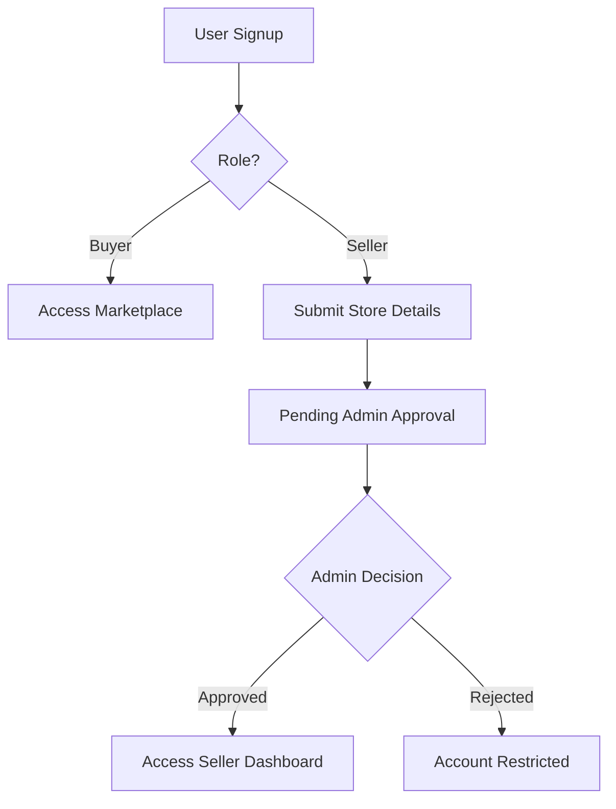
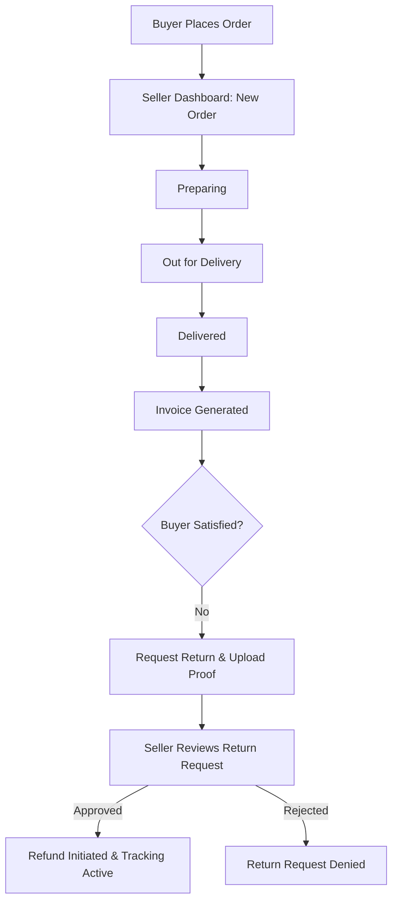

# VendorHub: Hyperlocal Marketplace

VendorHub is an advanced, **Hyperlocal E-commerce Marketplace** designed to bridge the gap between local vendors and neighborhood buyers. By digitizing local commerce, VendorHub allows buyers to discover and purchase products from shops in their immediate vicinity, ensuring lightning-fast delivery and supporting the local economy.

---

## 🚀 The USP: Precise Location Logic
The core philosophy and Unique Selling Point of VendorHub is its **Hyperlocal Connectivity**.
- **Hyperlocal Approach:** Unlike global e-commerce, VendorHub focuses on proximity. It ensures that the marketplace is relevant to the buyer's current location.
- **Precise Location Filtering:** Buyers provide their location (via GPS or saved addresses), and the platform uses MongoDB's `$geoNear` spatial aggregation to filter products within a specific distance range (e.g., 5km - 10km).
- **Active Range Validation:** The system dynamically calculates the distance between the seller and buyer to ensure products are only visible and purchasable if they are within the delivery radius.

---

## 👥 Users of the Website
1.  **Buyers:** Local residents looking for quick, neighborhood-based delivery and a personalized shopping experience.
2.  **Sellers:** Local shopkeepers and vendors who want to digitize their storefront and reach nearby customers.
3.  **Admins:** Platform moderators who verify seller credentials and maintain the integrity of the marketplace.

---

## 🔐 Login & Signup Flow
- **Buyer Onboarding:** A straightforward signup process with email and password, allowing immediate access to the marketplace.
- **Seller Onboarding & Verification:**
    - Sellers sign up and provide store details (GST, Location, Store Name).
    - **Admin Approval:** Every seller account is initially set to "Pending". An admin must manually review and approve the seller before they can list products.
    - Once approved, the seller gains full access to their specialized dashboard.

---

## 🛠️ System Workflows

### 1. Onboarding Workflow


### 2. Order Fulfillment & Return Workflow


---

## 🏪 Seller Dashboard & Features
The Seller Dashboard is a comprehensive command center for local vendors:
- **Smart Analytics:** Real-time overview of total earnings, pending orders, and active inventory status.
- **Order Management:** Detailed view of incoming orders with sequential status tracking (`Placed` ➔ `Preparing` ➔ `Out for Delivery` ➔ `Delivered`).
- **Automated Invoicing:** Professional PDF invoices are automatically generated and sent to buyers once an order is marked as `Delivered`.
- **Return Management:** A dedicated section where sellers can review buyer-uploaded proof (images/reasons) and approve or reject returns.
- **Inventory Control:** Real-time stock monitoring with automated alerts for low-stock items.

### ➕ Add Product Feature (5-Step Wizard)
Sellers list products through a structured, user-friendly process:
1. **Basic Info:** Name, brand, category, and subcategory.
2. **Pricing & Stock:** MRP, selling price, and inventory count.
3. **Media:** High-resolution product image uploads.
4. **Specifications:** Dynamic key-value pairs for technical details.
5. **Logistics:** Delivery time estimates and pickup availability.

---

## �️ Buyer Experience & Features
- **Personalized Profile:** Manage multiple delivery addresses and view detailed order history.
- **Dynamic Cart & Checkout:** Real-time validation of product availability, stock, and seller proximity.
- **Order Tracking:** Live status updates as the seller progresses the order through fulfillment stages.
- **Return Portal:** A dedicated interface for buyers to request returns by uploading image evidence and selecting reasons.

---

## 🤖 AI & Smart Features
VendorHub leverages AI to enhance the experience for both buyers and sellers:
- **Smart Recommendations:** A custom engine that analyzes browsing history and past orders to suggest personalized products.
- **AI-Powered Search (Fuse.js):** Advanced fuzzy matching and synonym understanding, providing typo-tolerant and relevant search results.
- **Smart Price Suggestion:** An AI tool for sellers that suggests optimal pricing for their products based on similar listings on the platform.
- **VendorHub AI Chatbot:** A smart assistant integrated into the platform to help users find products, track orders, and answer platform-related queries.

---

## 💳 Payment Simulation (Razorpay Sandbox)
The platform features a secure Razorpay integration. For testing transactions, use these credentials:

| Field | Value |
| :--- | :--- |
| **Card (Visa Domestic)** | `4100 2800 0000 1007` |
| **Expiry Date** | `12/29` (Any future date) |
| **CVV** | `123` (Any 3 digits) |
| **OTP** | `123456` (4+ digits for Success, <4 for Failure) |

---

## 🛠️ Technology Stack
- **Framework:** [Next.js](https://nextjs.org) (App Router)
- **Database:** [MongoDB](https://www.mongodb.com) (Geospatial Indexing with `2dsphere`)
- **Styling:** [Tailwind CSS](https://tailwindcss.com) (v4)
- **Animations:** [Framer Motion](https://www.framer.com/motion/) (Glassmorphic UI)
- **Search Logic:** [Fuse.js](https://fusejs.io/)
- **Payments:** Razorpay Node SDK
- **Icons:** [Lucide-React](https://lucide.dev/)

---

## ⚙️ Installation & Setup
1. **Clone & Install:**
   ```bash
   git clone https://github.com/sim675/DEvFusion
   npm install
   ```
2. **Environment Setup:** Create a `.env.local` file:
   ```env
   MONGODB_URI=your_mongodb_uri
   JWT_SECRET=your_jwt_secret
   NEXT_PUBLIC_RAZORPAY_KEY_ID=your_razorpay_key
   RAZORPAY_KEY_SECRET=your_razorpay_secret
   ```
3. **Run:**
   ```bash
   npm run dev
   ```

---

© 2024 VendorHub - Empowering Local Commerce.
